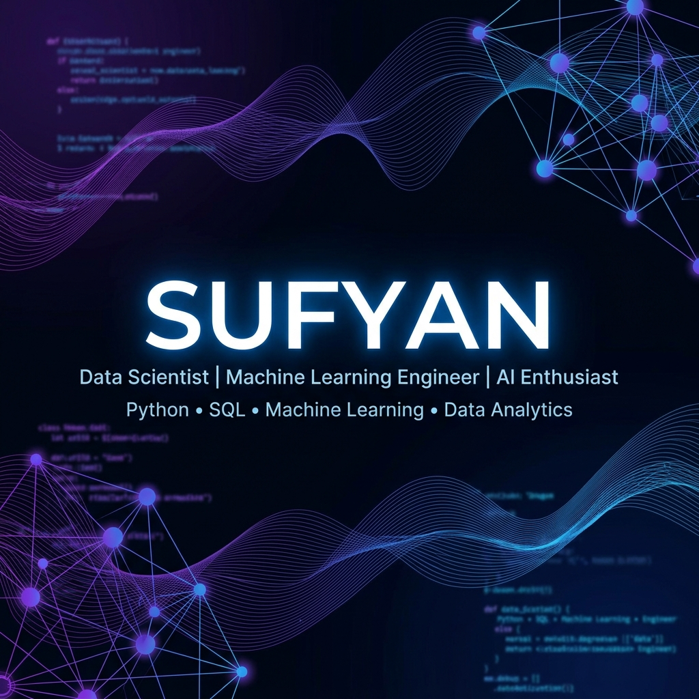

<!-- 
==================================================================================
🌟 SUFYAN'S PROFESSIONAL PORTFOLIO GITHUB PROFILE README
==================================================================================
Designed with a premium neon-purple & electric-blue aesthetic.
Make sure to replace all placeholder links marked with "sufyancreatives" 
or custom URLs with your actual profile links.
==================================================================================
-->

<div align="center">

  <!-- 🚀 Header Section -->
  <h1>Hi 👋, I'm Sufyan</h1>
  
  <!-- Dynamic Typing Subtitle using Readme Typing SVG -->
  <a href="https://git.io/typing-svg">
    
  </a>

  <p align="center">
    <strong>Building AI-powered solutions and exploring Data Science, Machine Learning, and Software Development.</strong>
  </p>

  <br />

  <!-- 🎯 Professional Banner -->
  

</div>

<br />

---

## 👨‍💻 About Me

<table border="0" cellpadding="10" cellspacing="0" width="100%">
  <tr>
    <td width="60%" valign="top">
      <p>🧠 <strong>Aspiring Data Scientist</strong> from Pakistan, passionate about decoding complex datasets and transforming them into predictive intelligence and actionable narratives.</p>
      <ul>
        <li>📚 <strong>Currently deep-diving into:</strong> Advanced Deep Learning, NLP, and Artificial Intelligence paradigms.</li>
        <li>💻 <strong>Working on:</strong> Customer Churn Prediction Models, High-Impact Data Analytics Pipelines, and Interactive Streamlit Dashboards.</li>
        <li>🎯 <strong>Ultimate Career Goal:</strong> To engineer next-generation AI solutions and drive intelligence at scale as a professional Data Scientist & AI Architect.</li>
        <li>⚡ <strong>Fun Fact:</strong> I see data as a story waiting to be told—and machine learning is my way of translation!</li>
      </ul>
    </td>
    <td width="40%" align="center" valign="middle">
      
    </td>
  </tr>
</table>

---

## 🛠 Tech Stack

<div align="left">

### 💻 Languages
<a href="#"></a>
<a href="#"></a>
<a href="#"></a>
<a href="#"></a>
<a href="#"></a>

### 📊 Data Science & Analytics
<a href="#"></a>
<a href="#"></a>
<a href="#"></a>
<a href="#"></a>
<a href="#"></a>

### 🧠 Machine Learning Expertise
<a href="#"></a>
<a href="#"></a>
<a href="#"></a>
<a href="#"></a>
<a href="#"></a>

### ⚙️ Tools & Infrastructure
<a href="#"></a>
<a href="#"></a>
<a href="#"></a>
<a href="#"></a>
<a href="#"></a>
<a href="#"></a>

</div>

---

## 📊 GitHub Statistics

<div align="center">
  <!-- Note: Replace "sufyancreatives" with your actual GitHub username -->
  <table border="0" cellpadding="0" cellspacing="10" width="100%">
    <tr>
      <td width="50%" align="center">
        
      </td>
      <td width="50%" align="center">
        
      </td>
    </tr>
    <tr>
      <td width="50%" align="center">
        
      </td>
      <td width="50%" align="center">
        
      </td>
    </tr>
  </table>
  
  <br />
  
  <!-- Dynamic Contribution Graph -->
  
</div>

---

## 🚀 Featured Projects

<table width="100%" border="0" cellspacing="10" cellpadding="10">
  <tr>
    <!-- Project 1 -->
    <td width="50%" valign="top" style="border: 1px solid #30363d; border-radius: 10px; padding: 15px; background: #0d1117;">
      <h3>📊 1️⃣ Customer Churn Prediction Dashboard</h3>
      <p>An interactive, full-stack ML application deployed on Streamlit, analyzing customer retention behaviors with precise ML classifiers.</p>
      <div>
        <span style="background: #238636; color: white; padding: 3px 8px; border-radius: 20px; font-size: 11px; margin-right: 5px;">Machine Learning</span>
        <span style="background: #1f6feb; color: white; padding: 3px 8px; border-radius: 20px; font-size: 11px; margin-right: 5px;">Data Viz</span>
        <span style="background: #8957e5; color: white; padding: 3px 8px; border-radius: 20px; font-size: 11px;">Streamlit</span>
      </div>
      <br />
      <a href="https://github.com/sufyancreatives/Customer-Churn-Prediction" target="_blank"><strong>Explore Project →</strong></a>
    </td>
    <!-- Project 2 -->
    <td width="50%" valign="top" style="border: 1px solid #30363d; border-radius: 10px; padding: 15px; background: #0d1117;">
      <h3>📈 2️⃣ Sales Analytics Dashboard</h3>
      <p>A comprehensive business intelligence platform mapping corporate sales trends, profit margins, and predictive forecasting pipelines.</p>
      <div>
        <span style="background: #238636; color: white; padding: 3px 8px; border-radius: 20px; font-size: 11px; margin-right: 5px;">BI</span>
        <span style="background: #1f6feb; color: white; padding: 3px 8px; border-radius: 20px; font-size: 11px; margin-right: 5px;">Python Visualizations</span>
        <span style="background: #e3b341; color: black; padding: 3px 8px; border-radius: 20px; font-size: 11px;">Data Analytics</span>
      </div>
      <br />
      <a href="https://github.com/sufyancreatives/Sales-Analytics-Dashboard" target="_blank"><strong>Explore Project →</strong></a>
    </td>
  </tr>
  <tr>
    <!-- Project 3 -->
    <td width="50%" valign="top" style="border: 1px solid #30363d; border-radius: 10px; padding: 15px; background: #0d1117;">
      <h3>🧠 3️⃣ Student Performance Prediction</h3>
      <p>An end-to-end predictive framework modeling student outcomes through advanced feature engineering and evaluation benchmarks.</p>
      <div>
        <span style="background: #238636; color: white; padding: 3px 8px; border-radius: 20px; font-size: 11px; margin-right: 5px;">Supervised ML</span>
        <span style="background: #1f6feb; color: white; padding: 3px 8px; border-radius: 20px; font-size: 11px; margin-right: 5px;">Predictive Analytics</span>
        <span style="background: #f78166; color: white; padding: 3px 8px; border-radius: 20px; font-size: 11px;">Feature Engineering</span>
      </div>
      <br />
      <a href="https://github.com/sufyancreatives/Student-Performance-Prediction" target="_blank"><strong>Explore Project →</strong></a>
    </td>
    <!-- Project 4 -->
    <td width="50%" valign="top" style="border: 1px solid #30363d; border-radius: 10px; padding: 15px; background: #0d1117;">
      <h3>💬 4️⃣ AI Chatbot</h3>
      <p>A smart, conversational natural language assistant trained on custom contexts with advanced NLP embeddings.</p>
      <div>
        <span style="background: #8957e5; color: white; padding: 3px 8px; border-radius: 20px; font-size: 11px; margin-right: 5px;">NLP</span>
        <span style="background: #1f6feb; color: white; padding: 3px 8px; border-radius: 20px; font-size: 11px; margin-right: 5px;">Python API</span>
        <span style="background: #238636; color: white; padding: 3px 8px; border-radius: 20px; font-size: 11px;">Generative AI</span>
      </div>
      <br />
      <a href="https://github.com/sufyancreatives/NLP-Projects" target="_blank"><strong>Explore Project →</strong></a>
    </td>
  </tr>
</table>

---

## 📚 Current Learning Journey

Here is what I am actively focusing on to push the boundaries of my intelligence framework:

```text
✅ Python Programming & Data Science Fundamentals
✅ Advanced Statistical Data Analysis & Exploratory Dashboards
✅ Classical Machine Learning (Supervised/Unsupervised Algorithms)

🔄 Deep Learning Architectures (ANNs, CNNs, RNNs)
🔄 Natural Language Processing (NLP) & Text Embeddings
🔄 Computer Vision Frameworks (OpenCV, PyTorch)

🎯 Production-Grade MLOps pipelines
🎯 Generative AI & LLM Integrations
```

---

## 🏆 Achievements

- **✔️ End-to-End Data Science Projects** — Translated messy raw files into structured dashboard applications.
- **✔️ Optimized Machine Learning Models** — Successfully built regression and classification models with high recall/precision.
- **✔️ Interactive Streamlit Applications** — Deployed multiple production-grade visual dashboards.
- **✔️ GitHub Portfolio Development** — Standardized modern repositories showcasing reproducible codebases.
- **✔️ Open Source Learning & Contribution** — Actively participating in tech communities and engineering blogs.

---

## 🎯 Why Hire Me?

<table>
  <tr>
    <td><strong>💪 Strong Data Analysis Skills</strong></td>
    <td>Able to discover deep patterns and extract valuable insights from chaotic, noisy datasets.</td>
  </tr>
  <tr>
    <td><strong>🧠 Machine Learning Mastery</strong></td>
    <td>Solid command of regression, classification, clustering, and end-to-end ML evaluation pipelines.</td>
  </tr>
  <tr>
    <td><strong>💡 Problem-Solving Mindset</strong></td>
    <td>Driven by engineering concrete, elegant, and intelligent solutions to address complex real-world issues.</td>
  </tr>
  <tr>
    <td><strong>🚀 Fast Learner & Adaptable</strong></td>
    <td>Thrive in evolving ecosystems; quickly master new frameworks, libraries, and best-practice workflows.</td>
  </tr>
  <tr>
    <td><strong>✨ AI Evangelist & Portfolio Ready</strong></td>
    <td>Equipped with a repository of modular projects showing full command of visual deployment and documentation.</td>
  </tr>
</table>

---

## 📅 2026 Goals

- [ ] 🎓 Complete Advanced Machine Learning Specializations
- [ ] 📁 Build & Deploy 20+ Production-Ready Data Science Projects
- [ ] 🤖 Master Deep Learning Architectures & PyTorch
- [ ] ⚙️ Automate Deployments with MLOps best practices
- [ ] 🌐 Contribute actively to open-source Machine Learning frameworks
- [ ] 💼 Secure a high-impact Data Science / Machine Learning Internship
- [ ] 🚀 Complete a stunning, fully-functional Custom Portfolio Website

---

## 📂 Recommended Portfolio Directory Structure

Here's how I organize my code repositories to ensure clean, structured, and modular layouts for recruiters:

```text
📂 Data-Science-Projects
│
├── 📂 Customer-Churn-Prediction      # Streamlit dashboard, Churn ML classifiers
├── 📂 Sales-Analytics-Dashboard        # Business intelligence charts & visualizations
├── 📂 Student-Performance-Prediction   # Regression models and feature pipelines
├── 📂 NLP-Projects                     # AI chatbot & text embeddings codebases
├── 📂 Deep-Learning-Projects           # Neural networks and PyTorch implementations
├── 📂 Streamlit-Apps                   # Live analytics dashboards and web interfaces
├── 📂 SQL-Projects                     # Complex database schemas and analytic queries
└── 📂 Portfolio-Website                # React/Next.js/HTML clean portfolio code
```

---

## 🌐 Connect With Me

<div align="center">
  
  <!-- Note: Replace placeholders with your actual social links -->
  <a href="https://github.com/sufyancreatives" target="_blank">
    
  </a>
  <a href="https://linkedin.com/in/YOUR_LINKEDIN_USERNAME" target="_blank">
    
  </a>
  <a href="https://kaggle.com/YOUR_KAGGLE_USERNAME" target="_blank">
    
  </a>
  <a href="mailto:YOUR_EMAIL_ADDRESS" target="_blank">
    
  </a>
  <a href="https://YOUR_PORTFOLIO_WEBSITE" target="_blank">
    
  </a>

</div>

<br />

<div align="center">
  
  ### 💡 Quote of the Day
  > *"Turning Data into Insights and Ideas into Intelligent Solutions."*

</div>

<br />
<hr />
<p align="center">⭐️ If you like what you see, feel free to star my repositories and connect! Deployed with ❤️ by Sufyan.</p>
